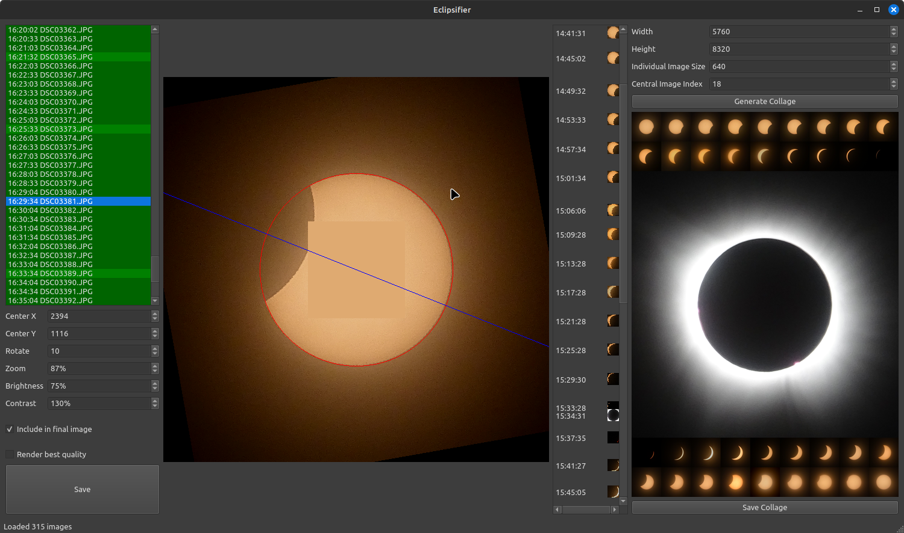

# Eclipsifier

This is a Python+Qt+Pillow program for aligning, adjusting, and arranging eclipse pictures into a nice little collage.



## Usage

```bash
# Clone the repo
git clone https://github.com/merlinz01/eclipsifier
# Enter the directory created
cd eclipsifier
# Create a virtual env
python3 -m venv .venv
# Activate the venv
source .venv/bin/activate
# Install the requirements
pip3 install -r requirements.txt
# Configure where your JPEG images are stored
echo "base_dir: /home/user/Pictures/eclipse_pictures" > ./config.yml
# Run the program
python3 eclipse.py
```

The program will load all the pictures in the base dir, which may take a while.

In the left-hand part of the window is the list of images.
Select any image to configure it.
The image will show in the center of the window with alignment guides for position and rotation,
and a color patch for brightness and contrast.

To align the sun in the center, you can drag on the image, or you can enter coordinates in the _Center X_ and _Center Y_ inputs.

To rotate the image so the moon's shadow is consistently aligned, adjust the _Rotation_ input.

To adjust the size of the sun, adjust the _Zoom_ input.

To adjust the brightness and contrast of the image, adjust the _Brightness_ and _Contrast_ inputs.

Select or deselect the _Include in collage_ checkbox to set whether the image is included in the final collage.

The _Render best quality_ checkbox removes the alignment and color guides and shows the configured image optimized for quality.

When you are done making any changes to an image, be sure to hit the _Save_ button to save your configuration details to a YAML file alongside the picture.

In the right-hand side of the window is a timeline of the images, with a preview of each included image positioned according to the time it was taken.
You can use this to help you select a nicely spaced sequence of images.

On the far right, you can configure the collage output.
The _Width_ and _Height_ inputs control the size of the collage.
The _Individual Image Size_ input controls the (square) size of the individual images in the collage.
The _Central Image Index_ input determines which image is featured full-width.

The images in the collage are arranged in a wrapped row from left to right.

Click _Generate Collage_ to assemble the collage. Click _Save Collage_ to save it as `collage.png` in the working directory.

# License

MIT License
